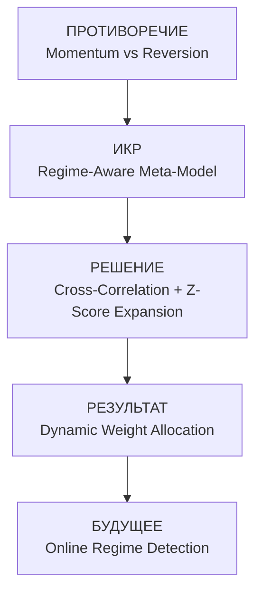

# Direction 3: Macro / Fundamental Analysis
**Date:** 2026-06-10  
**TRIZ Framework:** ПРОТИВОРЕЧИЕ → ИКР → РЕШЕНИЕ → РЕЗУЛЬТАТ

---

## 1. ПРОТИВОРЕЧИЕ (Contradiction)

> Markets exhibit both momentum AND mean reversion simultaneously.  
> Cross-asset relationships are unstable — Si may predict BR in one regime and lag in another.  
> The contradiction: *short-term momentum signals conflict with medium-term reversal probabilities*.

---

## 2. ИКР (Ideal Final Result)

> A regime-aware model that dynamically weights momentum vs. reversion based on cross-asset correlation structure.  
> ICR: *self-adjusting meta-strategy with zero parameter tuning*.

---

## 3. РЕШЕНИЕ (Solution)

### Data
- Source: `moex_prices_5m` (5-min bars) → resampled to daily close
- Tickers: Si, BR, RI, IMOEXF
- Period: 2023-01-03 → 2026-06-09
- Weekly returns computed over 5-trading-day rolling windows (no look-ahead)

### 3a. Cross-Correlation Analysis

| Predictor | Target | Same-Week ρ | Predictive ρ | Weeks |
|-----------|--------|-------------|--------------|-------|
| Si | BR | 0.1157 | 0.0944 | 641 |
| Si | RI | -0.5477 | -0.4505 | 641 |
| Si | IMOEXF | -0.1535 | -0.1589 | 641 |
| BR | Si | 0.1157 | 0.1394 | 641 |
| BR | RI | 0.06 | 0.0112 | 641 |
| BR | IMOEXF | 0.11 | 0.0646 | 641 |
| RI | Si | -0.5477 | -0.4185 | 641 |
| RI | BR | 0.06 | 0.0681 | 641 |
| RI | IMOEXF | 0.8623 | 0.7161 | 641 |
| IMOEXF | Si | -0.1535 | -0.1236 | 641 |
| IMOEXF | BR | 0.11 | 0.1067 | 641 |
| IMOEXF | RI | 0.8623 | 0.6777 | 641 |

#### Interpretation
- **Same-week correlation** measures contemporaneous linkage.
- **Predictive correlation** (predictor return this week → target return next week) reveals lead-lag structure.
- |>0.3| suggests economically meaningful relationship.

### 3b. Momentum → Reversal Analysis
> Hypothesis: weekly returns > +3% tend to reverse the following week (negative next-week return).

**Si**
- Total weeks: 867
- Strong-up weeks (>+3%): 81
  - Avg next-week return after momentum: 3.29%
  - % negative next week: 2.5%
- Strong-down weeks (<-3%): 67
  - Avg next-week return after reversal: -3.23%
  - % positive next week: 1.5%

**BR**
- Total weeks: 933
- Strong-up weeks (>+3%): 202
  - Avg next-week return after momentum: 4.68%
  - % negative next week: 7.4%
- Strong-down weeks (<-3%): 187
  - Avg next-week return after reversal: -4.65%
  - % positive next week: 3.7%

**RI**
- Total weeks: 924
- Strong-up weeks (>+3%): 145
  - Avg next-week return after momentum: 4.40%
  - % negative next week: 6.2%
- Strong-down weeks (<-3%): 137
  - Avg next-week return after reversal: -4.10%
  - % positive next week: 5.1%

**IMOEXF**
- Total weeks: 713
- Strong-up weeks (>+3%): 71
  - Avg next-week return after momentum: 4.59%
  - % negative next week: 4.2%
- Strong-down weeks (<-3%): 95
  - Avg next-week return after reversal: -3.77%
  - % positive next week: 5.3%

### 3c. Mean Reversion on Weekly Timeframe
> Z-score > |2| based on expanding window (all prior data). Does the market revert after extreme moves?

**Si**
- Weeks in sample: 868
- Z > +2 (extreme up): 19 events
  - Avg next-week return: 3.84%
  - % negative next week (reversion): 0.0%
- Z < -2 (extreme down): 28 events
  - Avg next-week return: -3.71%
  - % positive next week (reversion): 0.0%

**BR**
- Weeks in sample: 934
- Z > +2 (extreme up): 33 events
  - Avg next-week return: 10.05%
  - % negative next week (reversion): 0.0%
- Z < -2 (extreme down): 34 events
  - Avg next-week return: -8.52%
  - % positive next week (reversion): 0.0%

**RI**
- Weeks in sample: 925
- Z > +2 (extreme up): 32 events
  - Avg next-week return: 7.65%
  - % negative next week (reversion): 0.0%
- Z < -2 (extreme down): 45 events
  - Avg next-week return: -5.94%
  - % positive next week (reversion): 0.0%

**IMOEXF**
- Weeks in sample: 714
- Z > +2 (extreme up): 29 events
  - Avg next-week return: 6.21%
  - % negative next week (reversion): 3.4%
- Z < -2 (extreme down): 31 events
  - Avg next-week return: -4.87%
  - % positive next week (reversion): 3.2%

---

## 4. РЕЗУЛЬТАТ (Result)

### Summary of Key Findings
- **Si → RI**: predictive correlation = -0.4505 (negative, same-week = -0.5477)
- **Si → IMOEXF**: predictive correlation = -0.1589 (negative, same-week = -0.1535)
- **BR → Si**: predictive correlation = 0.1394 (positive, same-week = 0.1157)
- **RI → Si**: predictive correlation = -0.4185 (negative, same-week = -0.5477)
- **RI → IMOEXF**: predictive correlation = 0.7161 (positive, same-week = 0.8623)
- **IMOEXF → Si**: predictive correlation = -0.1236 (negative, same-week = -0.1535)
- **IMOEXF → BR**: predictive correlation = 0.1067 (positive, same-week = 0.11)
- **IMOEXF → RI**: predictive correlation = 0.6777 (positive, same-week = 0.8623)

### TRIZ Diagram

---
*Generated by macro_fundamental_analysis.py — Direction 3 of TRIZ research plan*
